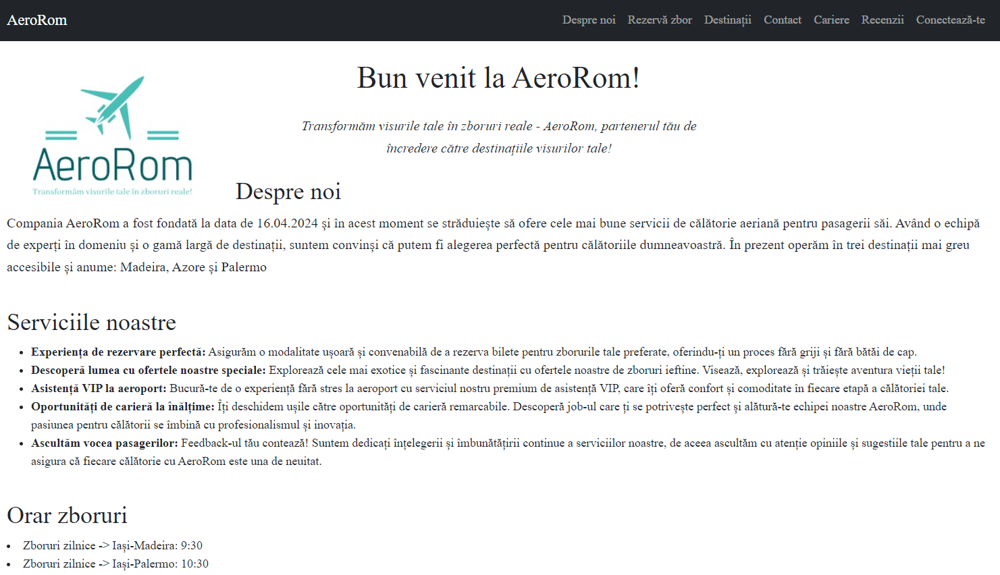
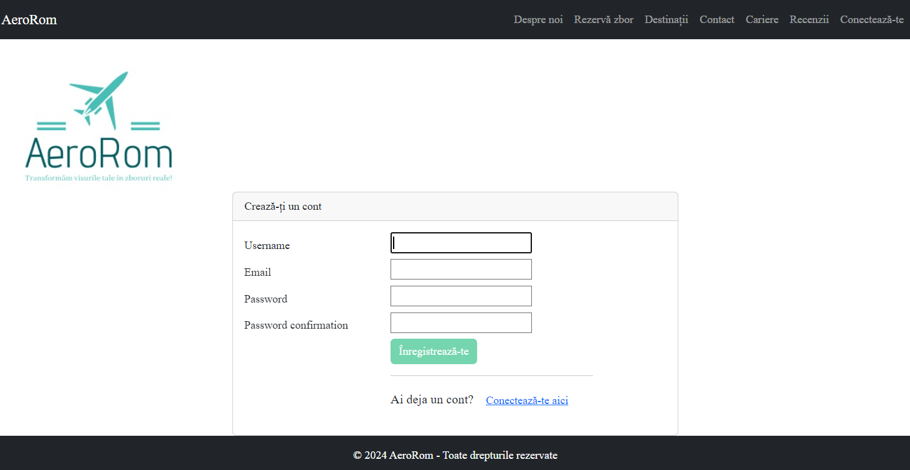
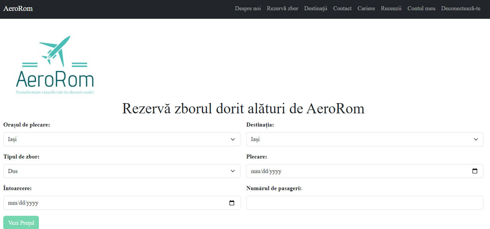
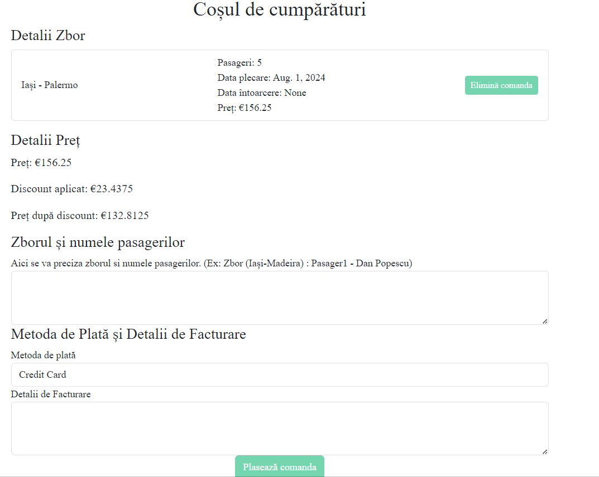
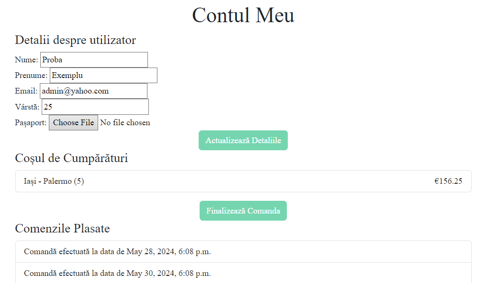

# Compania aeriană AeroRom
AeroRom este o aplicație web dezvoltată folosind Django. Prin intermediul acestei aplicații, permit utilizatorilor să facă rezervări de bilete, să acceseze informații despre companie, despre diferite oportunități de angajare, despre oferte atractive de zboruri și să adauge recenzii. Aplicația include funcționalități pentru logare, înregistrare și gestionarea contului utilizatorului.



## Funcționalități 

- **Acasă**: Portal pentru pagina principală cu diferite informații.
- **Despre Noi**: Pagina cu informații despre companie și personal.
- **Rezervă Zbor**: Pagină pentru rezervarea biletelor de zbor.
- **Destinații**: Informații despre destinații și promoții de sezon.
- **Cariere**: Informații despre oportunitățile de angajare.
- **Contact**: Formular de contact.
- **Politici și regulament**: Pagină care oferă informații despre regulile de bază ale companiei, politica de retur și bagaje.
- **Recenzii**: Pagini pentru adăugarea/vizualizarea recenziilor.
- **Contul Meu**: Pagina de gestionare a contului utilizatorului și a coșului de cumpărături.
- **Coșul de cumpărături**: Pagină care oferă posibilitatea utilizatorilor logați de a șterge bilete din coșul de cumpărături și de a plasa comenzi.
- **Autentificare și Înregistrare**: Paginile pentru logare și înregistrare utilizatori.


## Structura Proiectului

Proiectul este structurat în cinci foldere principale:

### 1. Directorul `aerorom`

Acest director gestionează paginile statice și modelele pentru secțiunile Acasă, Despre Noi, Cariere, Destinații, Contact și Recenzii.

- **static/**: Conține fișierele statice
  - **destinations**: Folder care conține poze cu detinațiile din proeiect
  - **logo.png**: Imaginea logo-ului
- **templates/**: Conține șabloanele HTML
  - **aerorom/**:
      - **add_review.html**: Șablon pentru pagina de adăugare a recenziilor
      - **company_info.html**: Șablon pentru pagina Despre Noi
      - **contact.html**: Șablon pentru pagina de contact
      - **destinations.html**: Șablon pentru pagina de destinații
      - **home.html**: Șablon pentru pagina principală
      - **job_info.html**: Șablon pentru pagina de cariere
      - **reviews.html**: Șablon pentru pagina de recenzii
- **admin.py**: Pentru gestionarea paginilor din pagina de administrator.
- **forms.py**: Formularele aferente paginilor de contact și recenzii.
- **models.py**: Modelele bazei de date pentru paginile Acasă, Despre Noi, Cariere, Destinații, Contact și Recenzii.
- **views.py**: Vederile care gestionează logica de afișare pentru paginile respective.
- **urls.py**: Definirea rutelor URL pentru paginile din această aplicație.

### 2. Directorul Principal `AviationCompany`

- **asgi.py**: Punctul de intrare pentru serverele ASGI.
- **settings.py**: Fișierul de configurare principală a aplicației Django.
- **urls.py**: Definirea rutelor URL principale ale aplicației.
- **wsgi.py**: Punctul de intrare pentru serverele WSGI.
- **manage.py**: Scriptul de management pentru proiectul Django.

### 3. Folderul `templates`
- **base.html** : Conține șablonul HTML utilizat ca referință pentru toate celelalte fișiere HTML din proiect

### 4. Directorul `tickets`

Această aplicație gestionează pagina de rezervări bilete.

- **static/**: Conține fișierele statice
  - **logo.png**: Imaginea logo-ului.
- **templates/**: Conține șabloanele HTML pentru paginile de gestionări bilete.
  - **tickets/**:
      - **cart.html**: Șablon pentru pagina aferentă coșului de cumpărături
      - **order_success.html**: Șablon pentru pagina de după plasarea comenzilor.
      - **tickets_list.html**: Șablon pentru pagina de bază de rezervări bilete.
- **admin.py**: Pentru gestionarea paginilor din pagina de administrator.
- **models.py**: Modelele bazei de date pentru pagina de rezervări bilete.
- **urls.py**: Definirea rutelor URL pentru pagina de rezervări bilete.
- **views.py**: Vederile care gestionează logica de afișare și procesare a rezervărilor.

### 5. Directorul `users`

Această aplicație gestionează logarea, înregistrarea și pagina 'Contul Meu'.


- **static/**: Conține fișierele statice
  - **logo.png**: Imaginea logo-ului.
- **templates/**: Șabloanele HTML pentru paginile de logare, înregistrare și gestionare a contului.
  - **registration/**:
      - **contul_meu.html**: Șablon pentru pagina de afișare a detaliilor utilizatorului.
      - **login.html**: Șablon pentru pagina de conectare(login).
      - **register.html**: Șablon pentru pagina de înregistrare.
- **forms.py**: Formularele utilizate pentru autentificare, înregistrare și actualizarea profilului.
- **models.py**: Modelele bazei de date pentru utilizatori și profiluri.
- **urls.py**: Definirea rutelor URL pentru autentificare, înregistrare și contul utilizatorului.
- **views.py**: Vederile care gestionează logica de autentificare, înregistrare și gestionare a contului.

## Pre-Requisite-uri

Asigură-te că ai instalat următoarele înainte de a începe:

- **Python 3.x**: [Descarcă Python](https://www.python.org/downloads/)
- **Git**: [Descarcă Git](https://git-scm.com/downloads)
- **PyCharm**: [Descarcă PyCharm](https://www.jetbrains.com/pycharm/download/?section=windows)

## Instrucțiuni de instalare și rulare a aplicației în virtual environment

Pentru a rula această aplicație local, urmează pașii de mai jos:

### 1. Clonarea repository-ului

Clonează repository-ul de pe GitHub în directorul tău local:

```bash
% git clone https://github.com/bacoscamadalina/AviationCompanyAeroRom
% cd AviationCompany
```

### 2. Creează în IDE un virtual environment folosind venv și activează-l:
```commandline
# Pentru Windows
% python -m venv venv
% venv\Scripts\activate

# Pentru macOS/Linux
% python3 -m venv venv
% source venv/bin/activate
```

### 3. Instalează toate pachetele necesare specificate în fișierul requirements.txt:
```commandline
% pip install -r requirements.txt
```

### 4. Execută migrațiile pentru a configura baza de date:
```commandline
% python manage.py makemigrations
% python manage.py migrate
```

### 5. Crează un superuser pentru a accesa pagina de administrare:

```commandline
% python manage.py createsuperuser
```

### 6. Pornește serverul de dezvoltare pentru a accesa aplicația în browser:
```commandline
% python manage.py runserver
```

Accesează aplicația în browser la adresa http://127.0.0.1:8000/.
### 7. Pentru a dezactiva virtual environment-ul, folosește comanda:
```commandline
% deactivate 
```

## Cum funcționează aplicația?
Prima dată când accesezi aplicația, pentru a avea acces la toate funcționalitățile, ar fi benefic să îți creezi un cont.

1. Accesează pagina de înregistrare.



2. Completează formularul cu numele de utilizator, adresa de email și  parola.
Apasă butonul „Înregistrează-te”. Dacă toate informațiile sunt corecte, vei fi autentificat automat și redirecționat către pagina principală.

Dacă ai deja un cont, conectează-te folosind datele de înregistrare.
După ce te-ai conectat, în meniul de sus, selectează „Rezervă zbor”.
Completează formularul de căutare a zborurilor:

1. Alege orașul de plecare.
2. Alege destinația.
3. Selectează tipul de zbor (dus sau dus-întors).
4. Alege data plecării și, dacă este cazul, data întoarcerii.
5. Introdu numărul de pasageri.
Apasă butonul „Vezi prețul”. În funcție de perioada de zbor și în funcție de câte bilete ai selectat, se pot adăuga automat reduceri menționate în pagina principala sau în pagina "Destinații".
După ce ai selectat zborul dorit, poți continua să finalizezi rezervarea. 




În "Contul meu" poți vedea toate zborurile pe care le-ai selectat, inclusiv comenzile plasate în trecut.



1. Adaugă/Actualizează datele tale personale din cont
2. Verifică din nou detaliile rezervării.
3. Adaugă detaliile despre pasageri, modalitatea de plată și detaliile de facturare
4. Apasă butonul „Plasează comanda”.

Felicitări, ai rezervat cu succes un zbor cu AeroRom! 
În cazul în care ai adăugat în coșul de cumpărături o comandă greșită, este de ajuns să apeși butonul "Elimină comanda" și comanda se va șterge.

Pe lângă aceste funcționalități principale, poți accesa pagina de recenzii pentru a-ți spune opinia sau pentru a vedea opiniile celorlalți pasageri. În plus, poți accesa pagina de cariere pentru a te înscrie la job-urile noastre.
Dacă întâmpini probleme, nu ezita să trimiți un mesaj din pagina de contact!


